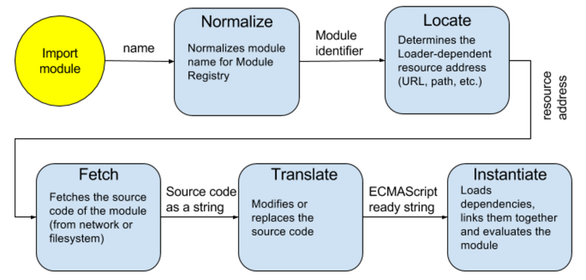

# Module Loaders: Master the Pipeline!


> This article is for developers who want to dig into JavaScript Module Loaders. We will look at how module loaders work, what the stages of the pipeline are, and how they could be customized. In the end we will write a simple plugin that will allow to use CoffeeScript modules in ES6 app.

> If you are new to modules in JavaScript I would recommend to start with [this article](https://addyosmani.com/writing-modular-js/) by Addy Osmani.

## Intro
The nature of a human brain is that it cannot deal with a lot of objects at the same time ([Miller’s Law](https://en.wikipedia.org/wiki/The_Magical_Number_Seven,_Plus_or_Minus_Two)). If you are going to build a large JavaScript application, you should stop, remember this limitation and start thinking in terms of modules.

Modules are a way to organize your application when you break your functionality into small pieces, think about how these pieces could work with each other, and then assembly them together. A module could be seen as a black box with a clear and preferably simple API. It is common that modules can depend on other modules.

For modern web development there are the following standards available for you to work with modules:
- [AMD](http://requirejs.org/docs/whyamd.html) - Asynchronous Module Definition, is good for loading modules asynchronously;
- [CommonJS](http://wiki.commonjs.org/wiki/Modules) - originally created for NodeJS, good for synchronous module importing;
- [ES6](https://whatwg.github.io/loader/) - a draft of the official standard for JavaScript modules, also supports synchronous loading.

They have different but similar APIs and serve the following tasks:
- define a module;
- load a module.

In this article we will skip the 1st task and focus on how a module can be loaded.

## Module Loader

Module system helps to simplify the process of working with modules. You can focus on development and only have to care about what modules you need for the one you are working on right now. It includes two features: module syntax and module loader.  Module loader performs the loading task, acts as a dependency manager and maintains a Module Registry [3].

Lets now look at the standards.

Current draft of ECMA-262 does not include the specification for module loaders since it was removed in 2014. You can still find it in the archive, it is a very useful resource. The new draft is now being developed by WHATWG and is not completed yet.

Here is how the specification describes what a module loader should do [2]:

> The JavaScript Loader allows host environments, like Node.js and browsers, to fetch and load modules on demand. It provides a hookable pipeline, to allow front-end packaging solutions like Browserify, WebPack and jspm to hook into the loading process.

Loader is a system for loading and executing modules, and there is a way to participate in the process. There are several Loader’s hooks which are called at various points in the process of loading a module. The default hooks are implemented on the Loader.prototype, and thus could be overridden/extended.

## Loader Pipeline
In the diagram you can see the different stages that Loader passes:



During the Normalize phase the Loader converts the provided name into a Module Identifier that will be used as a key to store the module info in Module Registry. The given name could be a relative path to the resource, it also could contain a shorthand mapping to a certain path, or any other logic that a particular Loader implementation provides.

The Locate phase serves to determine the final resource address that the Loader will use to fetch the resource from. It is either a URL (if the host is the browser), or a path (if the host is a NodeJS server).

During the Fetch phase Loader fetches the resource by provided address. It could be that module’s body is provided to the Loader directly, in which case this phase will be skipped. The result of this phase is a string with the source code of the module.

The Translate phase is probably the most interesting, because pure JavaScript is not the only way to program for web. There are a lot of popular options [5]: TypeScript, CoffeeScript (with all its dialects), Elm, Flow, next generation JS standards, etc. Technically, there is no limits for what could be used. You can use any programming language if you can provide a JS translator that will compile your code into JavaScript.

During the Instantiate phase module’s dependencies are loaded and linked together, then the module gets evaluated.

## Loading hooks

Now let’s see how the process could be extended. For each of the stages there is a hook which is a method that will be called with certain arguments. A hook can either return an immediate result or a promise.

When you override loader’s hook method you can also call the original method passing it the (likely modified) parameters as defined by the hook’s signature, but you don’t have to if you return the expected hook’s result.

> Below we will use the following syntax for describing hook’s signature:
> - “::” can be read as “has type of”;
> - the arrow sign “→” can be read as “returns”;
> - “args → result” defines a type as a function that takes one or multiple arguments;
> - (\<arg1\>, \<arg2\>) describes the arguments (one or more);
> - the result type will follow the arrow sign.

#### Normalize :: (name, referrerName, referrerAddress) → normalizedModuleName
Receives three arguments: name, referrerName, referrerAddress, and returns an eventual string which is a normalized module name. It is usually a path to the module file or folder from the root of the project. This way it uniquely identifies a module within the project.
Example: (“./math”, undefined, undefined)  → “utils/math”.

#### Locate :: loadRequest → loadRequest
Receives loadRequest object which name property is a normalized module name, and adds an address property to it which holds a resource address. It is called immediately after normalize unless the module is already loaded or loading.

Example:
```
loadRequest = {		      →	    loadRequest = {
    name: “utils/math”			    name: “utils/math”
}                               address: “http://example.com/utils/math.js”
                              }
```
#### Fetch :: loadRequest → sourceCodeString
Receives loadRequest object with address property, and returns an eventual string containing the source code of the module.

Example:
```
loadRequest = {		      →	    “import Math from ‘Math’;↳↳let a = 10; ...”
    name: “utils/math”,
    address: “http://example.com/utils/math.js”
}
```

#### Translate :: loadRequest → ecmaCompliantSourceCodeString
Receives loadRequest with source property which is a result of the fetch. The purpose of this hook is to translate the source code from another programming language into ECMAScript.

Example:
```
	loadRequest = {		              →	    “import Math from ‘Math’;↳↳var a = 10; ...”
    name: “utils/math”,
    address: “http://.../math.js”
    source: “import Math from ‘Math’;↳↳let a = 10; ...”
  }
```

#### Instantiate :: loadRequest → instantiationRequest
Instantiating the translated source. Receives loadRequest with source property as a translated source. Returns an eventual instantiationRequest object which has two required properties. The value of the deps property is an array of strings. Each string is the name of module dependencies. The value of the execute property is a function which the loader will use to create the module.

Example:
```
	loadRequest = {			            →   instantiationRequest = {
    name: “utils/math”,				          deps: [],
    address: “http://...math.js”,			  execute: fn
    source: translatedSource,			    }
    metadata: {...}
	}
```

The module is evaluated during the linking process. First, all of the modules it depends upon are linked and evaluated, and then passed to the execute function. Then the resulting module is linked with the downstream dependencies.

## Loader Implementations and Plugins

Module feature is not yet standardized, but there is ES6 Module Loader Polyfill [6]. It provides an asynchronous loader (System.import) to dynamically load ES6 modules. It also supports Traceur, Babel and TypeScript for compiling ES6 modules and syntax into ES5 in the browser with source map support.

If you want to work with modules that are built with different standards (AMD, CommonJS, ES6), there is an option for a Universal dynamic module loader - SystemJS.

### Let’s write a plugin

Plugin is a way to extend a loader implementation. Below is an example of a simple plugin for StealJS module loader (which is built on top of SystemJS) that allows you to use CoffeeScript modules in ES6 environment.

Let’s start with an obvious: define a translate hook that will compile a CoffeeScript module into JavaScript. We will do this with in a CommonJS manner because remember: SystemJS (thus StealJS) is a universal module loader.

```javascript
// This is a CoffeeScript compiler:
var CoffeeScript = require('./coffee-script');

// The hook that will be called during the translate phase:
exports.translate = function(load) {
  // For CoffeeScript compile options see [7].
  var result = CoffeeScript.compile(load.source, {
    sourceMap: true,	// Generate source map.
                      // If true then returns
                      // 	{js, v3SourceMap, sourceMap}
                      // false then returns just js string.
    sourceFiles: [load.address + '!orig'],

    bare: true		// Compile without a top-level fn wrapper
  });

  // CoffeeScript generates source map in V3 spec format:
  var v3SourceMap = JSON.parse(result.v3SourceMap);

  // Return the translated source code string.
  var resultString = result.js + sourceMap;

  // Add a sourceMap for a better debugging in browser:
  load.source += '\n//# sourceMappingURL=' + getSourceMapBase64(v3SourceMap, load.source);

  // Alternatively, you can attach a source property containing the result string to the load object without returning anything:
  // load.source = resultString;

  return resultString;
};
```

CoffeeScript generates a source map in V3 spec format [8]. Here is how we can encode it into base64 [9]:

```
function getSourceMapBase64(sourceMap, orig){

  // Provide original code inline:
  sourceMap.sourcesContent = [orig];

  // Add offset to account on CJS wrapper:
  sourceMap.mappings = ';;' + sourceMap.mappings;

  sourceMap = JSON.stringify(sourceMap);

  return 'data:application/json;base64,' + btoa(unescape(encodeURIComponent(sourceMap)));
}
```

Now we need to tell StealJS to use the plugin for files with “.coffee” extension. We do this by providing the following config for our plugin’s package.json:

```
"system": {
  "ext": {
    "coffee": "steal-coffee"
  }
}
```

Now you can have your module written with CoffeeScript:

```
square = (x) -> x * x

math =
  root:   Math.sqrt
  square: square
  cube:   (x) -> x * square x

module.exports = math;
```

and in your ES6 application you can import the module:

```
import math from 'mathModule.coffee';
console.log(math.cube(2));
```

The full source and instructions on how to use the plugin you can see here [10].

## Finale

To recap. We looked at what a module system is, what standards are available for modern web development, then we dived into ES6 loader pipeline and saw how it could be extended. And finally wrote a simple loader’s plugin for translating CoffeeScript.

## Links

- http://wiki.ecmascript.org/doku.php?id=harmony:specification_drafts#august_24_2014_draft_rev_27
- https://whatwg.github.io/loader/#module-loading
- http://code.matthewphillips.info/modules-in-the-browser/#/4
- https://github.com/ModuleLoader/es6-module-loader
- https://github.com/ModuleLoader/es6-module-loader/blob/master/docs/loader-extensions.md
- https://github.com/jashkenas/coffeescript/wiki/list-of-languages-that-compile-to-js
- https://github.com/ModuleLoader/es6-module-loader
- http://coffeescript.org/documentation/docs/coffee-script.html
- http://www.html5rocks.com/en/tutorials/developertools/sourcemaps/#toc-anatomy
- https://github.com/jashkenas/coffeescript/blob/1.9.3/lib/coffee-script/sourcemap.js#L122
- https://www.npmjs.com/package/steal-coffee

Links for those who are new to Module Loaders:
- https://addyosmani.com/writing-modular-js/
- http://guybedford.com/practical-workflows-for-es6-modules
- http://requirejs.org/docs/whyamd.html


