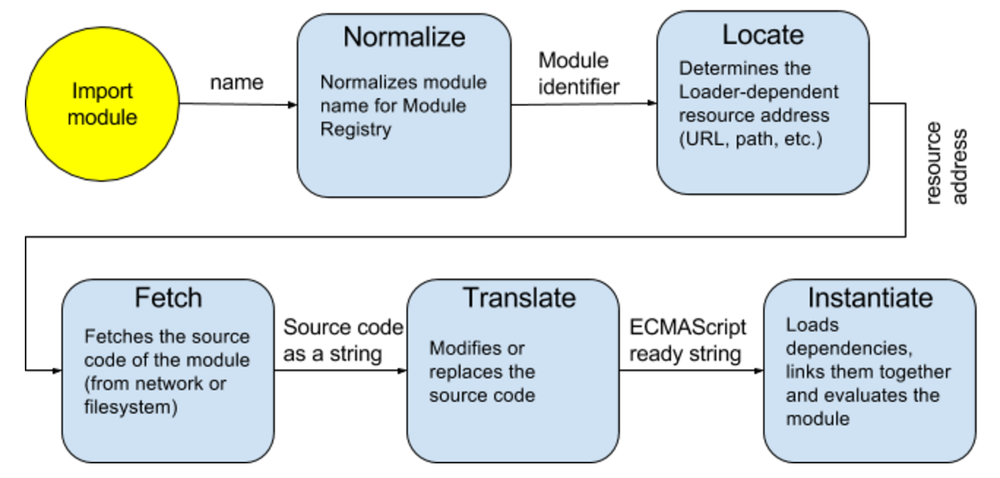

# Module Loaders: How they work, and How to write a plugin

This article is for developers who want to dig into Module Loaders. We will look at how module loaders work, what are the stages of the pipeline and how they could be intervened.

In this article you will learn about how Module Loaders work, look at how the loading process could be extended, and implement a plugin for StealJS.
Intro
The nature of a human brain is that it cannot deal with a lot of objects at the same time [1]. If you build large JavaScript applications you should consider this limitation.

Modules is a way to organize your application. A module could be seen as a black box with a clear and preferably simple API. It is common that modules can depend on other modules.

For modern front-end development there are the following standards available for you to work with modules:
- AMD;
- CommonJS;
- ES6.

They have different but similar APIs because they serve the following most basic tasks:
- define a module;
- load a module.

In this article we will skip the 1st task and focus on how a module can be loaded.

## Module Loader

The tool that performs a loading module task is called... Module Loader. In old days the most common way to have a module was to create a JavaScript file that creates a global variable, and load this file into a browser with a regular script tag. So, there was no need in this tool.

The complications start when you have to deal with a lot of modules. What could happen in this case? The most obvious problems are:
- a name collision. Especially, if you use an external modules that you don’t actually control. You never know what one can pollute the global namespace with.
- a wrong order of modules being loaded;
- circular dependencies.

Module loader helps to simplify the process of working with modules. You can focus on development and only have to care about what modules you need for the one you are working on right now. It also acts as a dependency manager and maintains a module registry [3].

Lets now look at the standards.

Current draft of [ECMA-262](https://tc39.github.io/ecma262/) does not have the specificationf for module loader since it was removed in 2014. You can still find it in the [archive](http://wiki.ecmascript.org/doku.php?id=harmony:specification_drafts#august_24_2014_draft_rev_27), and as of now it is the most useful source. The new draft is now being developed by WHATWG and is not completed yet.

The specification for the module loader was removed from the ES6/ES2015 specification in 2014 and transferred to WHATWG. It’s not completed yet, but here is what we can get from it + looking up the archive.

Here is how the specification describes what a module loader should do [2]:

```
The JavaScript Loader allows host environments, like Node.js and browsers, to fetch and load modules on demand. It provides a hookable pipeline, to allow front-end packaging solutions like Browserify, WebPack and jspm to hook into the loading process.
```

Loader is a system for loading and executing modules, and there is a way to participate in the process. There are several Loader’s hooks which are called at various points in the process of loading a module. The default hooks are implemented on the Loader.prototype, and thus could be overridden/extended.

## Loader Pipeline
In the diagram you can see the different stages that Loader passes:



During the Normalize stage the Loader converts the provided name into a Module Identifier that will be used as a key to store the module info in Module Registry. The given name could be a relative path to the resource, it also could contain a shorthand mapping if one is defined for the Loader, or any other logic that a particular Loader implementation provides.

The Locate phase serves to determine the final resource address that the Loader will use to fetch the resource from.

During the Fetch phase Loader fetches the resource by provided address. It could be that module’s body is provided to the Loader directly, in which case this phase will be skipped. The result of this phase is a string with the source code of the module.

The Translate phase is probably the most interesting, because pure JavaScript is not the only way to program for web. There are a lot of popular options [5]: TypeScript, CoffeeScript (with all its dialects), Elm, Flow, next generation JS standards, etc. Technically, there is no limits for what could be used. You can use any language if you can provide a JS translator that will compile your code into JavaScript.
Loading hooks
Now let’s see how the process could be extended. For each of the stages there is a hook which is a method that will be called with certain arguments. A hook can either return an immediate result or a promise.


### Normalize :: (name, referrerName, referrerAddress) → normalizedModuleName
Receives three arguments: name, referrerName, referrerAddress, and returns an eventual string which is a normalized module name.

```
Example: “./math” → “utils/math”.
```

### Locate :: loadRequest → loadRequest

Receives loadRequest object which name property is a normalized module name, and adds an address property to it which holds a resource address. It is called immediately after normalize unless the module is already loaded or loading.

```
Example:
loadRequest = {		→	loadRequest = {
    name: “utils/math”			    name: “utils/math”
} 					    address: “http://example.com/utils/math.js”
}
```

### Fetch :: loadRequest → sourceCodeString

Receives loadRequest object with address property, and returns an eventual string containing the source code of the module.

```
Example:
loadRequest = {		→	 “import Math from ‘Math’;↳↳let a = 10; ...”
    name: “utils/math”,
    address: “http://example.com/utils/math.js”
}
```

### Translate :: loadRequest → ecmaCompliantSourceCodeString

Receives loadRequest with source property which is a result of the fetch. The purpose of this hook is to translate the source code from another programming language into ECMAScript.

```
Example:
	loadRequest = {		→	“import Math from ‘Math’;↳↳var a = 10; ...”
	    name: “utils/math”,
    address: “http://.../math.js”
    source: “import Math from ‘Math’;↳↳let a = 10; ...”
}
```

### Instantiate :: loadRequest → instantiationRequest

Instantiating the translated source. Receives loadRequest with source property as a translated source. Returns an eventual instantiationRequest object which has two required properties. The value of the deps property is an array of strings. Each string is the name of module dependencies. The value of the execute property is a function which the loader will use to create the module.

The module is evaluated during the linking process. First all of the modules it depends upon are linked and evaluated , and then passed to the execute function. Then the resulting module is linked with the downstream dependencies.

```
Example:
	loadRequest = {			→	 instantiationRequest = {
    name: “utils/math”,				    deps: [],
    address: “http://...math.js”,			    execute: fn
    source: translatedSource,			}
    metadata: {...}
	}
```

## Links
- http://wiki.ecmascript.org/doku.php?id=harmony:specification_drafts#august_24_2014_draft_rev_27
- https://whatwg.github.io/loader/#module-loading
- http://code.matthewphillips.info/modules-in-the-browser/#/4
- https://github.com/ModuleLoader/es6-module-loader
- https://github.com/ModuleLoader/es6-module-loader/blob/master/docs/loader-extensions.md
- https://github.com/jashkenas/coffeescript/wiki/list-of-languages-that-compile-to-js


